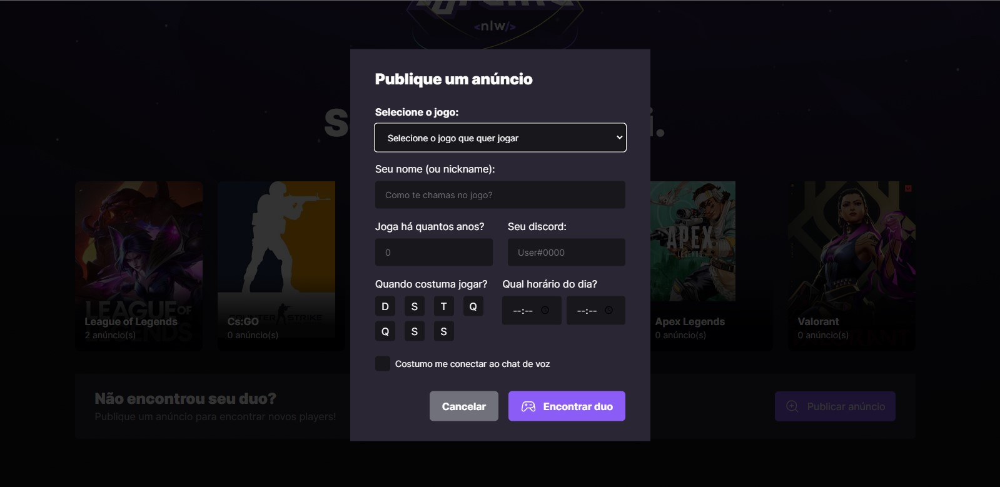

<div align="center">
</div>

<br>

Projeto desenvolvido durante a semana do NLW eEsports da Rocketseat.

Um diferencial que tentei implementar foi rodar o projeto utilizando o docker, porém ele funciona subindo um container de cada vez, mas quando utilizamos o docker-compose ele dá um erro de **prisma generate**, tentei consertar e não consegui, pois ainda não tenho conhecimentos em prisma, mas quando adiquirir esse conhecimento voltarei para consertar. Mas fora isso o projeto está rodando normal.
<hr>

**A fazer:** Novas telas, validação de formulários, refatoração do backend, consertar erro do prisma generate.

<hr>
<br>

- [Descrição](#descrição)
- [Ferramentas](#ferramentas)
- [Como rodar o projeto](#start)
- [Docker Compose](#compose)

<br>

## Descrição

O projeto consiste numa plataforma para encontrar o parceiro perfeito para jogar seu jogo favorito juntos, conectando sua conta do Discord.

Para encontrar seu parceiro, você deverá publicar um anuncio preenchendo alguns dados como: Nick do jogo, Discord, nome do jogo, há quantos anos você joga o game, horário de inicio e fim que costuma jogar, etc...




## Ferramentas

- TypeScript
- Node.js
- Express
- Prisma
- React
- Tailwind css
- Radix UI

## Start

### Server

Vá até a pasta **server**, crie um novo arquivo chamado ``.env`` no diretório raiz, usando o arquivo `.env.example` como base.

Para iniciar o servidor, execute:

```sh
npm install
npx prisma migrate dev
npm run dev
```

**Usando o Docker** Execute:

```sh
docker build -t serverimg .
docker run --name server -d -p 3000:3000 serverimg
```

### Web

Vá até a pasta **web**, e execute:

```sh
npm install
npm run dev
```

**Usando o Docker** Execute:

```sh
docker build -t webimg .
docker run --name web -d -p 5137:5137 webimg
```

## Compose

Na raiz do projeto, execute:

```sh
docker compose up
```
